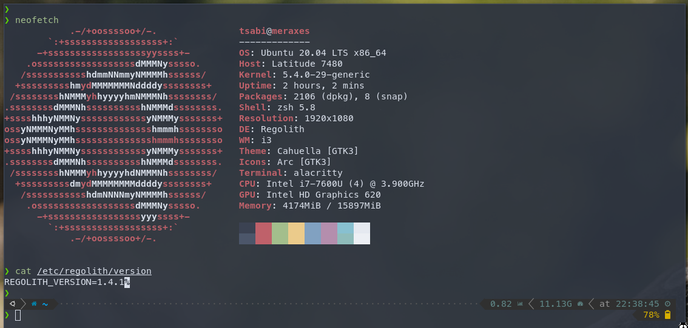

# dotfiles
Config files for [Regolith Desktop](https://regolith-linux.org/) and zsh environment with [oh-my-zsh](https://ohmyz.sh/).<br>
<br>
The repo is meant to be cloned into your home dir and the environment to be created by [stow](https://www.gnu.org/software/stow/).<br>
## Necessary packages 
on top of the above:<br>
- alacritty
- autojump
- colorls
- fonts-hack
- fonts-powerline
- fzf
- maim
- [p10k theme](https://github.com/romkatv/powerlevel10k#oh-my-zsh)

## Usage
```
cd ~
git clone git@github.com:lehoczkics/dotfiles.git
cd dotfiles
stow zsh \
	i3 \
	alacritty
```

