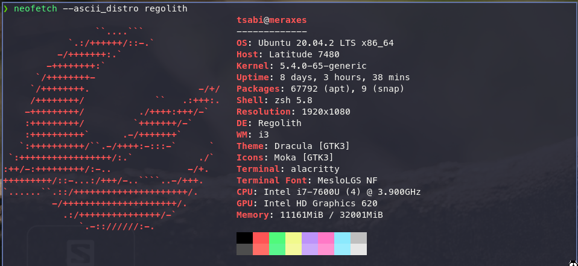

# dotfiles
Config files for [Regolith Desktop](https://regolith-linux.org/) and zsh environment with [oh-my-zsh](https://ohmyz.sh/).<br>
<br>
GTK and Alacritty (and everything else I was able to adjust) theme: [Dracula](https://draculatheme.com/)<br>
<br>
The repo is meant to be cloned into your home dir and the environment to be created by [stow](https://www.gnu.org/software/stow/).<br>
## Necessary packages 
on top of the above:<br>
- alacritty
- autojump
- bat
- colorls
- delta
- dracula-gtk
- fonts-hack
- fonts-powerline
- fzf
- maim
- [p10k theme](https://github.com/romkatv/powerlevel10k#oh-my-zsh)

## Install guide
Spin up your favourite Ubuntu live environment ( my flavour is [Mate](https://ubuntu-mate.org/download/amd64/focal/) ) and follow [zfs-installer](https://github.com/64kramsystem/zfs-installer).<br>
[Zsys](https://packages.ubuntu.com/focal/zsys) is good to have as well<br>
After installation is done, [add Regolith PPA and install regolith-desktop](https://regolith-linux.org/docs/getting-started/install/#ppa-install)

## How to use this repo
```
cd ~
git clone git@github.com:lehoczkics/dotfiles.git
cd dotfiles
stow zsh \
	i3 \
	alacritty \
	bat \
	gitconfig
```

